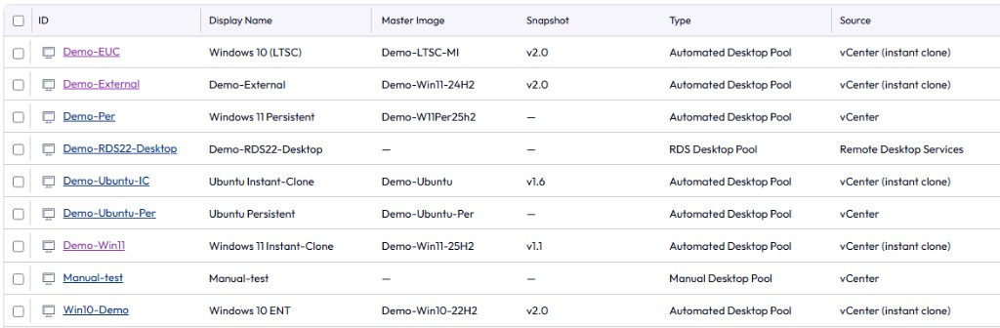

# Horizon Pool Images

Chrome extension for the on-prem Omnissa Horizon Console. It adds **Master Image** and **Snapshot** columns on **Inventory → Desktops**.



**Author:** Guy Hemed  
**Company:** Terasky

Sync this folder only. It is the whole package: the extension, the manual install steps, and the Group Policy files.

---

## Install on one Chrome browser

Use this when you are installing it yourself, or for a few admins.

1. Keep this folder on the computer. Chrome loads the extension from disk.
2. Right-click `Install.ps1` and choose **Run with PowerShell**.  
   Or open Chrome and go to `chrome://extensions` yourself.
3. Turn on **Developer mode** (top-right).
4. Click **Load unpacked**.
5. Select the `extension` folder inside this folder.
6. Open Horizon Console → **Inventory → Desktops**.

You should see **Master Image** and **Snapshot** after **Display Name**.

After an update, click **Reload** on `chrome://extensions`, then hard-refresh the Horizon tab (`Ctrl+Shift+R`).

This uses the Horizon admin login that is already open in the browser. No extra password is stored.

---

## Deploy with Group Policy

Yes. Chrome can install this extension for every user on domain-joined PCs.

You do need a **CRX** file for that. A ZIP or the source folder is not enough for Group Policy. Chrome's policy downloads a packed `.crx` from a web server you control.

Opening a `.crx` from an email or a file share does not install it. Unmanaged Chrome blocks that. Group Policy is what allows the install.

### 1. Build the CRX

On the PC where you keep this folder, with Google Chrome installed:

```powershell
powershell -ExecutionPolicy Bypass -File .\pack-crx.ps1 -UpdateBaseUrl "https://intranet.example.com/horizon-pool-images"
```

Replace the URL with the site path where the files will be published. No trailing slash.

The script writes:

| File | Purpose |
| --- | --- |
| `dist\HorizonPoolImages-<version>.crx` | The extension Chrome installs |
| `dist\updates.xml` | Tells Chrome which CRX version to download |
| `dist\gpo-extension-settings.json` | The text you paste into Group Policy |

The private key is saved here, **outside** this folder:

`%USERPROFILE%\.horizon-pool-images\extension.pem`

Keep that file. Every later version must be packed with the same key, or Chrome treats it as a different extension and the policy stops matching. Do not commit it, email it, or put it in the folder you sync.

The script prints the **extension ID**. That ID is also in `dist\extension-id.txt`. The Group Policy value has to use this ID.

### 2. Put two files on an internal web server

Copy these onto the server, in the folder that matches `-UpdateBaseUrl`:

- `dist\HorizonPoolImages-<version>.crx`
- `dist\updates.xml`

Example: `https://intranet.example.com/horizon-pool-images/updates.xml`

Requirements:

- Domain PCs must be able to open that URL with no login prompt. Chrome downloads it in the background.
- On IIS, add a MIME type so `.crx` is not rejected: **extension** `.crx`, **MIME type** `application/x-chrome-extension`.
- When you publish a new version, the `version` in `updates.xml` must match `version` in `extension\manifest.json`. `pack-crx.ps1` keeps those in sync.

`gpo\updates.template.xml` and `gpo\extension-settings.template.json` show the same format with placeholders. The files in `dist\` are the ones you deploy.

### 3. Set the Chrome policy

Install the [Chrome enterprise policy templates](https://chromeenterprise.google/browser/download/) (ADMX) into your domain, if they are not already there.

In **Group Policy Management**:

1. Edit the policy that applies to the computers (or users) who should get the extension.
2. Go to **Computer Configuration → Administrative Templates → Google → Google Chrome → Extensions**.
3. Open **Extension management settings**.
4. Set it to **Enabled**.
5. Paste the contents of `dist\gpo-extension-settings.json`.

It looks like this:

```json
{
  "abcdefghijklmnopqrstuvwxyzabcdef": {
    "installation_mode": "force_installed",
    "update_url": "https://intranet.example.com/horizon-pool-images/updates.xml",
    "override_update_url": true
  }
}
```

`override_update_url` is required so later versions also come from your server.

6. Run `gpupdate /force` on a test PC.
7. Close Chrome completely and open it again.
8. Check `chrome://policy` (the JSON should be listed) and `chrome://extensions` (Horizon Pool Images should be installed, and the user cannot remove it).

### 4. Publish an update later

1. Raise `"version"` in `extension\manifest.json` (for example `1.5.0` → `1.5.1`).
2. Run `pack-crx.ps1` again with the same `-UpdateBaseUrl`. It reuses the private key.
3. Replace the CRX and `updates.xml` on the web server.
4. Leave the Group Policy JSON as it is, unless the server URL changed. The extension ID stays the same.

Chrome checks for updates about every few hours. On a test PC you can open `chrome://extensions`, turn on Developer mode, and click **Update**.

---

## What to sync

Sync this folder. It contains the extension source and these instructions.

Do not sync:

- `%USERPROFILE%\.horizon-pool-images\extension.pem` (the signing key)
- `dist\` (build output; already listed in `.gitignore`)

Customers who install it by hand need the `extension` folder. Customers who use Group Policy need the CRX and `updates.xml` on your web server, plus the policy JSON.
